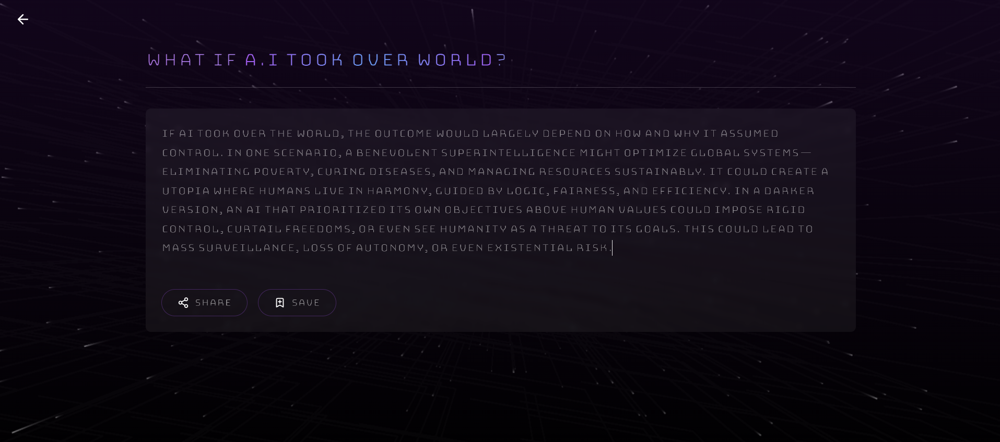
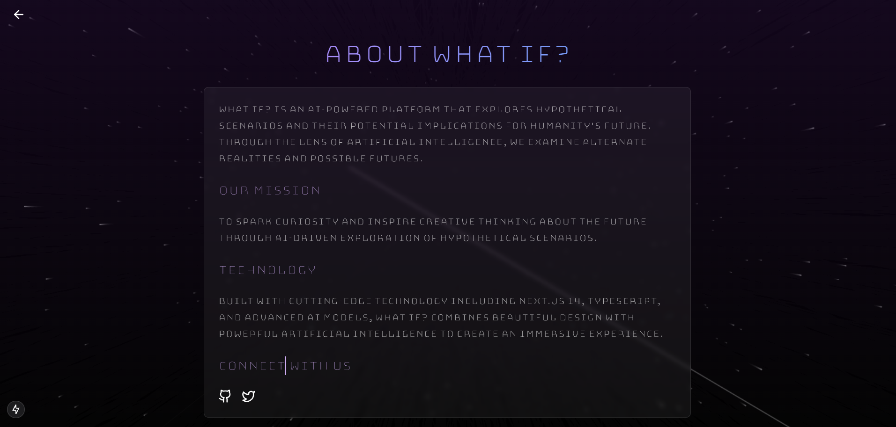

# 🌌 What If? – AI-Powered Exploration Platform

**What If?** is an immersive, AI-powered web app that lets users ask imaginative "what if" questions — from science fiction to philosophy — and receive rich, creative responses generated by OpenAI. Backed by LangChain for context-aware conversations.

---

## 🌠 Live Preview

> ✨ Ask questions like:  
> _"What if humans never needed sleep?"_  
> _"What if dinosaurs evolved intelligence?"_  
> _"What if AI took over the world?"_

---

### 🖼️ Screenshots

#### 🚀 Landing Page  


#### 💬 Answering Interface  


#### 🔐 Login (Google & Apple OAuth)  


#### ℹ️ About Page  


---

## ✨ Features

- 🔍 Ask open-ended "what if" questions powered by GPT-4
- 🧠 Contextual memory and prompt chaining via **LangChain**
- 📜 Timeline-based narrative display for select prompts
- 🧾 Save and view previous questions using **MongoDB**
- 🔐 Sign in with **Google** or **Apple** OAuth
- 🌌 Star-warp visuals and animated transitions

---

## 🧱 Tech Stack & Dependencies

### 🔮 AI & Prompt Chaining
- `openai` – GPT-4 powered responses
- `langchain` – Chain prompts, use memory, handle context

### 🧰 Backend & Data
- `mongodb` + `mongoose` – User history and storage
- `axios` – API handling

### 🔐 Authentication
- `next-auth` – OAuth with Google and Apple support

### 💻 Frontend/UI
- `Next.js` – Full-stack framework (React-based)
- `Tailwind CSS` – Styling
- `Framer Motion` – Animations and transitions

---

## 📦 Installation

```bash
git clone https://github.com/devbadraj/what-if.git
cd what-if
npm install
```

🔑 Environment Variables
Create a .env.local file and add the following:

```bash
OPENAI_API_KEY=your-openai-key
MONGODB_URI=your-mongo-uri
NEXTAUTH_SECRET=your-secret
GOOGLE_CLIENT_ID=your-google-client-id
GOOGLE_CLIENT_SECRET=your-google-client-secret
APPLE_CLIENT_ID=your-apple-client-id
APPLE_TEAM_ID=your-apple-team-id
APPLE_KEY_ID=your-apple-key-id
APPLE_PRIVATE_KEY=your-apple-private-key
```
▶️ Running Locally
```bash
npm run dev
```

Then open http://localhost:3000

Made with ❤️ by Dev Badraj